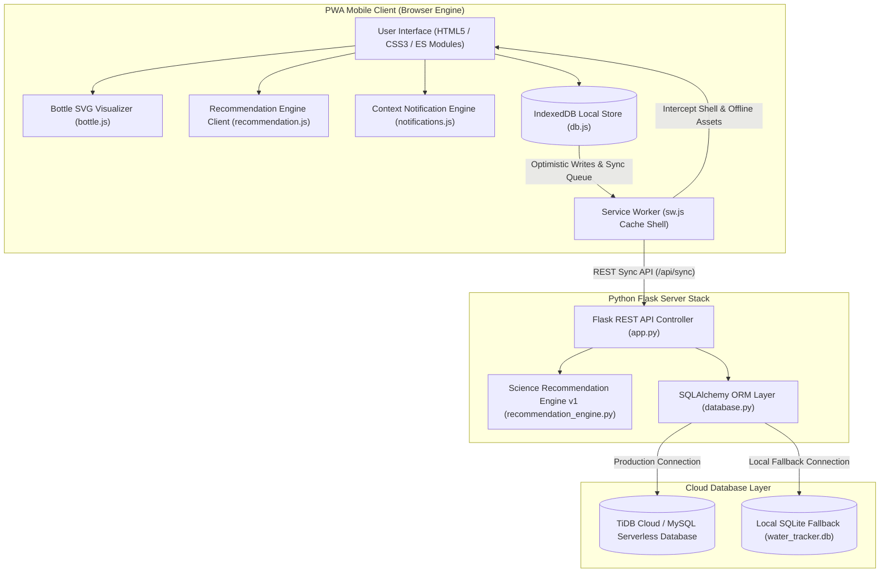
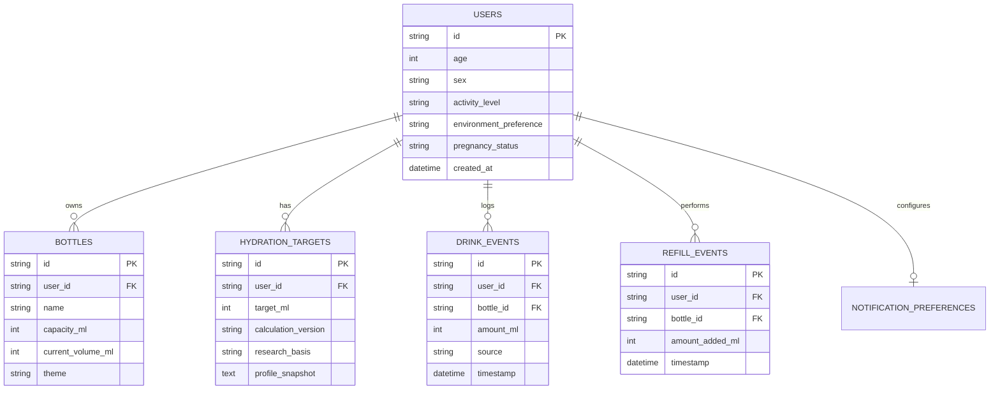

# Architecture Specification - Research-Based Hydration Tracker PWA

## 1. High-Level System Architecture

The application adopts an **Offline-First Progressive Web Application** architecture with an event-driven data model, client-side IndexedDB cache, Flask REST API backend, and TiDB online database integration.



---

## 2. Science Recommendation Engine Architecture (`v1`)

The recommendation engine isolates scientific calculation logic into versioned modules (`CALCULATION_VERSION = "v1"`), ensuring historical targets remain audit-traceable.

### Mathematical & Logical Formulation

#### 1. Baseline Fluid Target ($F_{\text{baseline}}$)
Based on Institute of Medicine (IOM) Dietary Reference Intakes (DRIs):
- **Male (19+)**: Total Water = $3700\text{ ml/day}$. Beverage Fluids = $80\% \times 3700 = 2960\text{ ml}$.
- **Female (19+)**: Total Water = $2700\text{ ml/day}$. Beverage Fluids = $80\% \times 2700 = 2160\text{ ml}$.
- **Unspecified**: Total Water = $3200\text{ ml/day}$. Beverage Fluids = $80\% \times 3200 = 2560\text{ ml}$.

#### 2. Physiological Context Adjustments
- **Pregnancy**: $+300\text{ ml}$ fluid.
- **Lactation / Breastfeeding**: $+880\text{ ml}$ fluid ($80\%$ of $+1.1\text{ L}$ total water).

#### 3. Activity Level Multiplier ($M_{\text{act}}$)
$$\text{ActivityAdd} = \text{round}(F_{\text{baseline}} \times (M_{\text{act}} - 1.0))$$
- Sedentary: $1.0\times$
- Lightly Active: $1.10\times$ ($+10\%$)
- Moderately Active: $1.20\times$ ($+20\%$)
- Highly Active: $1.35\times$ ($+35\%$)

#### 4. Environmental Adjustment ($\text{EnvAdd}$)
- Indoors: $+0\text{ ml}$
- Mixed: $+150\text{ ml}$
- Outdoors: $+350\text{ ml}$

#### 5. Target Rounding
$$\text{Target}_{\text{ml}} = 50 \times \text{round}\left( \frac{F_{\text{baseline}} + \text{PregAdd} + \text{ActivityAdd} + \text{EnvAdd}}{50} \right)$$

---

## 3. Data Models & Database Schemas

### Entity Relationship Diagram



### IndexedDB Local Schema Architecture (`HydrationTrackerDB`)

| Object Store | Key Path | Indices | Description |
| :--- | :--- | :--- | :--- |
| `profile` | `id` | - | Current user profile |
| `bottle` | `id` | - | Physical bottle capacity & state |
| `hydration_target` | `id` | - | Target snapshot & science metadata |
| `drink_events` | `id` | `timestamp` | Recorded drink events |
| `refill_events` | `id` | `timestamp` | Recorded bottle refill events |
| `sync_queue` | `id` | `queued_at` | Queue for offline server synchronization |

---

## 4. Offline-First & Idempotent Sync Protocol

1. **Instant Write (0ms Latency)**: When the user taps a drink or refill button, data is saved immediately to IndexedDB (`drink_events` or `refill_events`) and added to `sync_queue`.
2. **Optimistic UI Update**: UI elements (bottle water level, daily progress percentage) update instantly before network dispatch.
3. **Background Sync Listener**:
   - `sw.js` and `app.js` listen for `online` network events.
   - When online, `app.js` posts the `sync_queue` batch to `POST /api/sync`.
4. **Server Idempotency**:
   - All client events use client-generated UUIDs (`drk_174000_abc`, `rfl_174000_xyz`).
   - Flask API ignores already-committed event IDs, preventing duplicate consumption records.

---

## 5. Service Worker Caching Strategy

The PWA service worker (`static/sw.js`) manages static shells and network requests:

```
Request Event
    │
    ├─► URL starts with '/api/'?
    │        ├── YES ──► Network-First Strategy (Fallback: JSON Offline Payload)
    │
    └─► Static Asset (HTML/CSS/JS/PNG)?
             └── YES ──► Stale-While-Revalidate Strategy (Serve Cached + Update Cache)
```

---

## 6. Directory Structure

```text
water_tracker/
├── app.py                     # Flask application entry point & REST routes
├── config.py                  # Environment config & TiDB/SQLite connection setup
├── database.py                # SQLAlchemy ORM models
├── recommendation_engine.py   # Science calculation engine v1 (Python)
├── generate_icons.py          # Script to generate PWA PNG icons
├── pyproject.toml             # Python project dependencies (uv)
├── design.md                  # Comprehensive UX & visual design specification
├── architecture.md            # System architecture & data flow specification
├── static/
│   ├── index.html             # Single Page Application HTML shell
│   ├── manifest.json          # Web App Manifest for PWA installation
│   ├── sw.js                  # Service Worker with offline shell cache & sync
│   ├── css/
│   │   └── app.css            # Mobile-first CSS design system & bottle wave CSS
│   ├── js/
│   │   ├── app.js             # Main SPA coordinator & screen router
│   │   ├── db.js              # IndexedDB persistence layer
│   │   ├── bottle.js          # SVG Physical Water Bottle component
│   │   ├── glass.js           # Glass vessel drinking animation component
│   │   ├── recommendation.js  # Client recommendation engine mirror
│   │   └── notifications.js   # Smart context notification evaluator
│   └── icons/
│       ├── icon-192.png       # 192x192 PWA Icon
│       └── icon-512.png       # 512x512 PWA Icon
└── tests/
    ├── test_api.py            # API integration tests
    └── test_recommendation.py # Recommendation engine unit tests
```
